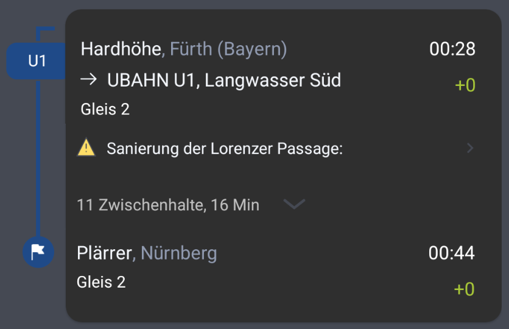
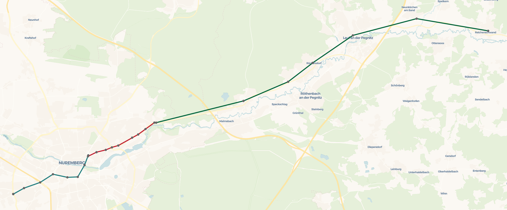

# OpenFahrplan


OpenFahrplan is a pet project to explore the technologies and challenges behind public transport IT systems.
Keep reading to see how the idea formed, what I learned about public transport, and the challenges I faced while implementing a Python-based journey planner.

## Project Diary
### The initial idea
It all started on one evening mid-2025 when I was visiting a friend in a suburb of Fürth, and it was almost time to leave.
As always, I checked [NüMo](https://nuernbergmobil.de/), the app of Nurembergs public transport agency [VAG](https://www.vag.de/) to see when I need to leave
and whether there are any disruptions on the journey. Because the journey only runs about every 30 minutes, I pay special
attention to disruptions on this journey, since missing a transfer means I have to wait half an hour for the next one.

The journey looks something like this in the app:



The yellow warning icon suggests a disruption on this journey - or does it? Actually no, because the
disruption at `Lorenzer Passage` only affects the station `Lorenzkirche`, which I don't even need to take on that journey.
Apparently, NüMo checks for disruptions on the lines used but not whether the affected stations are actually part of the journey.

Later when I sat at the bus station, again looking at the NüMo app for possible updates on my bus, I asked myself:
* How would I solve this issue if I had built the app?
* Why is it implemented this way?
* Am I the only one who notices that?
* Is NüMo developed in house by VAG or outsourced?

When the bus finally arrived and I was comfortably seated, I started my research and as soon as I got home I decided it was time for a new pet project.

### Implementing the journey planning
To implement the journey planning I hoped I could simply use a public API, and from a quick search I found https://bundesapi.github.io/vag-api/,
which looked promising at first, but it only provided live departure times. Unfortunately I could not find a public API for journey planning,
but at least there's https://www.vgn.de/web-entwickler/open-data/, which provides the full timetable in the GTFS format.

> GTFS (General Transit Feed Specification) is an open standard for sharing public transit timetables between agencies and journey planners. 
> It essentially is a relational dataset represented as csv files. The most important tables for my use case
> are `stops` (name and location of a station), `trips` (the order in which stations are visited), and `stop_times` (the actual arrival and departure times). 
> 
> Learn more about GTFS at https://gtfs.org/getting-started/what-is-GTFS/

To plan a journey form a GTFS dataset, you need a suitable public transport routing algorithm.
For car routes you can easily represent road networks as a graph and find the best journey by using a shortest path algorithm like dijkstras algorithm or A*.
For public transport, however, you must also account for transfer times between lines and line frequencies. 
Fortunately there are a number of different [public transport routing algorithm](https://transnetlab.github.io/transit-routing/html/index.html).
I chose RAPTOR because it had the most available resources, but others might be faster or more memory efficient. 
Raptor finds optimal journeys by scanning the timetable iteratively and adding more reachable stations each round until the 
destination can be reached. I started by reading the original [paper by Microsoft Research](https://www.microsoft.com/en-us/research/wp-content/uploads/2012/01/raptor_alenex.pdf)
but quickly realized that a glimpse at the paper is not enough, and I'd had to study it much more thoroughly to confidently
implement the algorithm myself. Because I only wanted to build a simple demo I decide to try asking ChatGPT for an implementation 
and see how well that works. To my surprise the result was better than expected, but still far from a "correct" 
solution. ChatGPT's algorithm certainly found *a* journey, but the journey took longer than it should, the transfers times were incorrect and
it took about 20s to find a journey. But it was definitely good enough for now and I decided to work on the disruption alert for a while. To finish the routing algorithm later
I told ChatGPT where it was wrong and what I thought was the cause, and achieved significant improvements, though it still occasionally produces incorrect results. This journey, for example,
has an unnecessary extra bus (red) in it and then waits an hour at one station for no reason.



### Displaying disruption alerts
To display disruption alerts, I initially wanted to parse the official [VAG disruptions website](https://www.vag.de/fahrplan/fahrplanaenderungen-stoerungen), but
it wasn't possible to reliably identify the affected stations, e.g. there is an alert for "Sanierung der Lorenzer Passage", but the stations name is "Lorenzkirche".
So I decided to use OpenAI's API to also get those tricky matches. The code looked like this:
```python
def gtfs_get_disruptions(feed):
    raw = mock_disruptions
    if os.getenv("OPENAI_API_KEY"):
        url = "https://www.vag.de/fahrplanaenderungen-stoerungen"
        resp = requests.get(url, timeout=3)
        resp.raise_for_status()
        soup = BeautifulSoup(resp.text, "html.parser")
        texts = [item.get_text(" ", strip=True) for item in soup.select_one(".linieninfo_list").select(".stoerung__item")]
        prompt = f"""
            Here are disruption announcements from various agency websites:

            {json.dumps(texts, ensure_ascii=False, indent=2)}

            Task:
            - Identify the affected stop names mentioned in each entry.
            - For each stop, list the disrupted lines.
            - If multiple lines are disrupted at the same stop, put them all in the list.
            - If no stops are clearly affected, skip them.
            - If you cant find an affected line, but the word "Aufzug" is mentioned, pretend the line is "Elevator"

            Return ONLY valid JSON array of objects in this format:
            [
              {{"stop_name": "Gustav-Adolf-Str.", "disruptions": ["U1"]}},
              {{"stop_name": "Plärrer", "disruptions": ["U1", "U2"]}}
            ]
            """

        resp = client.responses.create(
            model="gpt-4.1-mini",
            input=prompt
        )

        raw = resp.output[0].content[0].text.strip()
        print("Successfully issued openai request")
    try:
        data = json.loads(raw)
    except json.JSONDecodeError:
        data = []

    disruptions = pd.DataFrame(data)
    disruptions["stop_id"] = disruptions.apply(lambda row: gtfs_find_station_grouped(feed,row["stop_name"].squeeze())["stop_id"],axis=1)
    disruptions["color"] = disruptions["disruptions"].apply(get_disruption_color)
    return disruptions
```

Later, I discovered that GTFS also has an extension called GTFS-Realtime, which has exactly the purpose of supplying live data for a gtfs dataset.
Unfortunately there is no official feed, but I found https://gtfs.de/de/realtime/ which provides at least some disruptions. 
Again, that should be enough for my pet project.

### Visualizing the results
At first, I hadn’t planned to display journeys on a map, but I quickly realized that visualization helps understand what is happening behind the scenes of the RAPTOR algorithm.
Initially I used [matplotlib](https://matplotlib.org/), because I was already familiar with it, but it lacked interactivity, 
so I switched to [Dash + plotly](https://dash.plotly.com/), which offers similar features to matplotlib, but also lets you build rich web apps around the visualizations.
I liked Dash as it's really easy to get a simple app and running, but I wouldn't recommend it for production apps. When compared to full stack javascript frameworks like NextJS
it just isn't as customizable and especially displaying loading indicators has been a bit tricky.

## Development
```shell
poetry install
docker buildx build --platform linux/amd64,linux/arm64 -t ghcr.io/danielr1996/openfahrplan:latest --push .
helm upgrade --install --create-namespace -n openfahrplan openfahrplan chart/
```

## License and Attribution
### Source Code / Software
All source code in this repository authored by the project’s contributors is licensed under the [MIT License](./LICENSE.md).

Third-party packages installed via package managers (e.g. npm, pip, crates.io) remain subject to their own respective licenses as provided by their authors and distributors.

### Data
This repository also contains non-code materials subject to different licensing terms:

- `data/parquet/vgn` — [© VGN – Verkehrsverbund Großraum Nürnberg GmbH](https://www.vgn.de/web-entwickler/open-data/), licensed under [Creative Commons Attribution 3.0 Germany (CC BaY 3.0 DE)](https://creativecommons.org/licenses/by/3.0/de/), converted to parquet format.
- `data/parquet/gtfsde` —  [GTFS.DE](https://gtfs.de), licensed under [Creative Commons 4.0](https://creativecommons.org/licenses/by/4.0/), converted to parquet format.
