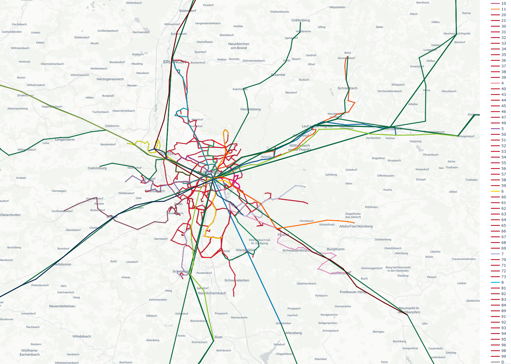

# openfahrplan
OpenFahrplan is a demo project to showcase ideas for, and explore the topic of, passenger information systems for 
public transport services.

You can see all the routes in the VAG/VGN network, and station with disruption notices. One thing is definitely want to explore is implementing RAPTOR to find the best
route from A to B.




## Usage
> to get up to date disruption notices OpenFahrplan uses the openai API and you need to provide an api key as OPENAI_API_KEY 
> environment variable if you want to use those, otherwise some sample disruptions will be displayed.

```shell
poetry install
poetry run python main.py
```

## License and Attribution
### Source Code / Software
All source code in this repository authored by the project’s contributors is licensed under the [MIT License](./LICENSE).

Third-party packages installed via package managers (e.g. npm, pip, crates.io) remain subject to their own respective licenses as provided by their authors and distributors.

### Data
This repository also contains non-code materials subject to different licensing terms:

- `data/gtfs/vgn` — Public transport schedule data [© VGN – Verkehrsverbund Großraum Nürnberg GmbH](https://www.vgn.de/web-entwickler/open-data/), licensed under [Creative Commons Attribution 3.0 Germany (CC BY 3.0 DE)](https://creativecommons.org/licenses/by/3.0/de/).

## References
https://kuanbutts.com/2020/09/12/raptor-simple-example/
https://www.microsoft.com/en-us/research/wp-content/uploads/2012/01/raptor_alenex.pdf
https://dash.plotly.com/